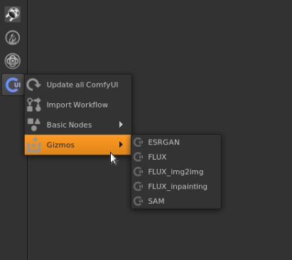

# ComfyUI Gizmos for Nuke:
#### Pre-assembled gizmos for ComfyUI within Nuke

1. Require [nuke_comfyui](https://github.com/vinavfx/nuke_comfyui) to use them.

<i>If you don't have some node included in the gizmo, install the Plugin in ComfyUI 
when you get the message that the node or model does not exist !</i>

## Installation
``` sh
# Linux:
cd ~/.nuke/nuke_comfyui/nodes
git clone https://github.com/vinavfx/ComfyUI-Gizmos-for-Nuke Gizmos

# Windows
cd C:\Users\<username>\.nuke\nuke_comfyui\nodes
git clone https://github.com/vinavfx/ComfyUI-Gizmos-for-Nuke Gizmos
```

<div style="display: flex;">
  
</div>
